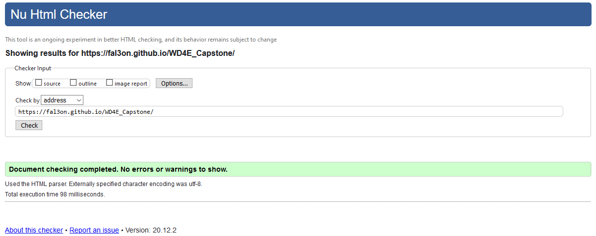
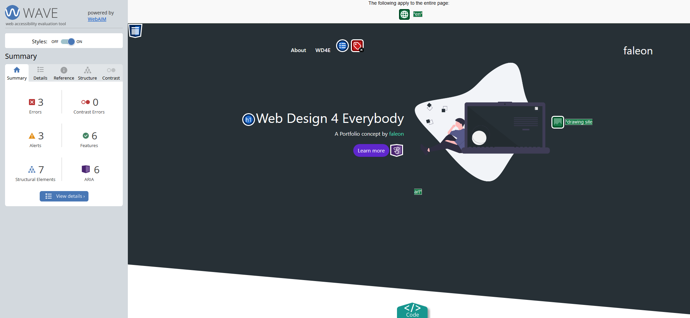

# Project Description

This concept was created by faleon using Bootstrap a little pinch of JS and CSS/SASS for the course "Web Design for Everybody Capstone" Taught by the University of Michigan on Coursera. The purpose is to emulate a responsive portfolio type site with at least 3 functional sections. All of the above getting a full validation at "validator.w3.org".

### Validator.w3.org Results

  

### Wave Results

Note that most of the "errors" have a functional purpose, feel free to check them by your self with the "https://webaim.org/" plugin.

  

### Check the live demo at:   https://fal3on.github.io/WD4E_Capstone/